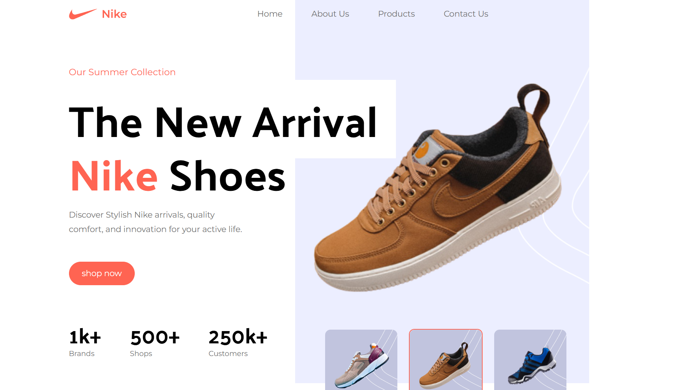
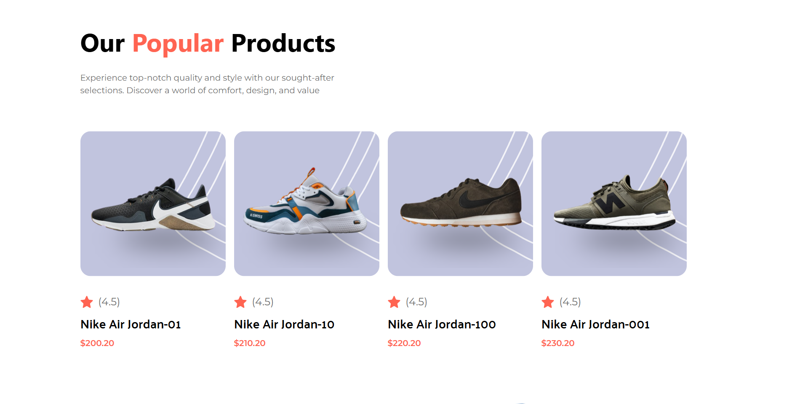
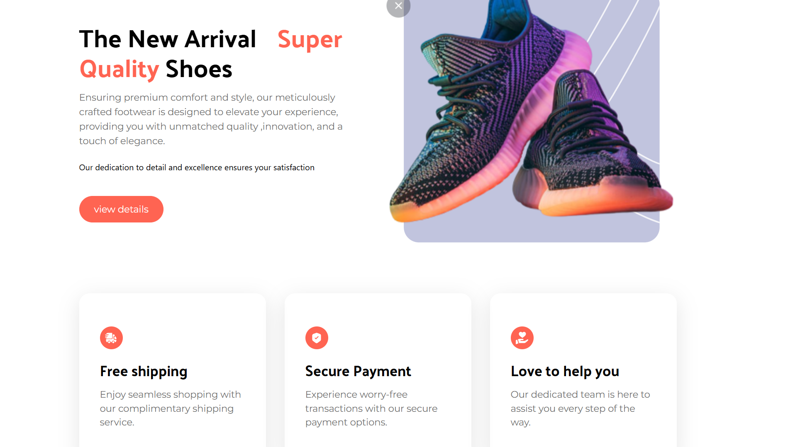

# Nike — React + Vite + Tailwind demo

An example front-end project built with React and Vite, styled using TailwindCSS with a few custom utilities. The repository demonstrates common UI sections for an e-commerce-like layout (navigation, hero, product cards, reviews, and footer) and provides a small, easy-to-extend foundation for experimentation and learning.

This README is written in English and covers setup, available scripts, the project structure, and a few styling notes relevant to this codebase.

## Preview





## Key features

-    React + Vite for a fast development experience
-    TailwindCSS with a small set of custom utilities defined in
`src/index.css`
-    Modular component structure: components live in `src/Components` and page sections in `src/sections`

---


## Tech stack

-    React 19
-    Vite
-    TailwindCSS
-    PostCSS / Autoprefixer

## Prerequisites

-    Node.js (modern LTS) and npm

## Install & run

1. Install dependencies:

```powershell
npm install
```

2. Start development server (hot-reload):

```powershell
npm run dev
```

The available scripts come from `package.json`: `dev`, `build`, `preview`, `lint`.

## Project structure (important files)

-    `index.html` — app entry
-    `src/main.jsx` — React entry
-    `src/App.jsx` — app layout & sections
-    `src/index.css` — Tailwind imports and custom utilities (e.g. `padding-x`, `max-container`)
-    `src/Components/` — reusable components (Nav, Button, ShoeCard, ...)
-    `src/sections/` — page sections (Hero, Footer, PopularProducts, ...)
-    `src/assets/` — images and icons
-    `tailwind.config.js` — Tailwind configuration (screens, colors, background images, etc.)

Example tree (short):

```
src/
  App.jsx
  main.jsx
  index.css
  Components/
    Nav.jsx
    Button.jsx
    ShoeCard.jsx
  sections/
    Hero.jsx
    Footer.jsx
    PopularProducts.jsx
  assets/
    images/
    icons/
```

## Styling & layout notes

-    Tailwind utilities are extended in `src/index.css` under `@layer utilities`. Some custom utilities you will see are `padding`, `padding-x`, `padding-t`, `padding-b`, and `max-container` (a centered max-width container).

-    Common footer layout pattern used here: a full-bleed background (e.g. `bg-black`) on the outer `section`, and a centered content wrapper inside (`max-container`) that limits content width. If you notice horizontal gaps on the footer background, typical causes are:

     1.   The outer wrapper has a utility like `padding-x` that adds horizontal padding to the background.
     2.   The inner footer component uses `max-container` which centers and constrains content (this is intentional in most designs).

-    In this repo I removed `padding-x` from the footer wrapper in `src/App.jsx` so the footer background spans edge-to-edge while the footer content remains centered inside the `Footer` component. If you want the footer content itself to also reach the edges, remove or change `max-container` in `src/sections/Footer.jsx`.

-    Small gotcha: there are a few typos like `xl:paddin-1` (missing an "g" in `padding`) in class names. These won't match Tailwind utilities and should be corrected where intended.

## Quick checks & troubleshooting

-    If CSS changes aren't visible:

     -    Ensure `src/index.css` includes `@tailwind base; @tailwind components; @tailwind utilities;` (it does in this project).
     -    Restart the Vite dev server after adding new custom utilities.

-    If an asset (image/icon) doesn't load, verify the path under `src/assets` and how it's imported in components.

